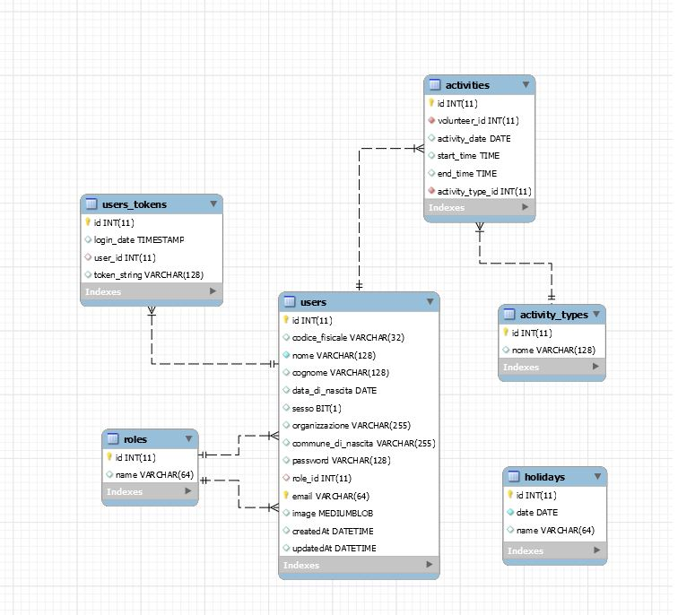

# Husky

Husky will run lint automatically before we commit our changes and also before we push to our Master Repository it checks the test files .

# To bypass this linting and testing process

Add <--no-verify> to your command line

# Try to run using this command line (npm run dev)

# Volunteer Attendance Tracking

The purpose of the project is to create a website that allows for volunteers' attendance to be tracked.

## Current solution

The times are recorded in an Excel spreadsheet using macros and Visual Basic. The spreadsheet is shared among the work groups where it is used to verify the attendance, holidays, sick days and permits.

## Attendance Tracking Instructions

### Volunteer Registration Form

| Field in English              | Field in Italian                     | Description                                                      |
| ----------------------------- | ------------------------------------ | ---------------------------------------------------------------- |
| Enter the date of the holiday | Inserisci la data del festivo locale | Date of the saint, which is considered a holiday, format dd / mm |
| First Name                    | Nome                                 | First name of the volunteer                                      |
| Last Name                     | Cognome                              | Last name of the volunteer                                       |
| Organization                  | Organizzazione                       | Name of the organization                                         |
| Location                      | Sede di Svolgimento                  | Address of the organization                                      |
| Activity Definition 1         | Definizione attività 1               | Description of the 3 major activities that the volunteer         |
| Activity Definition 2         | Definizione attività 3               | will carry out at the host organization                          |
| Activity Definition 3         | Definizione attività 3               | (eg: support for educators; office assistance; etc ...)          |

This information is then printed or saved as a PDF. The application would need to provide similar functionality.
This is the text in Italian that should be provided somewhere:

> si consiglia di stampare la presente pagina come frontespizio del registro presenze del volontario.
> la stampa è possibile seguendo le normali procedure di stampa documenti (oppure salvare in pdf con
> apposito tasto e poi stampare il doc)

This registration is only done the first time the program is used.

### Timetable and Activities Form

#### Terms

| Field in English                                               | Field in Italian                                              |
| -------------------------------------------------------------- | ------------------------------------------------------------- |
| choose the date                                                | scegli la data                                                |
| total hours indicated                                          | totale ore indicate                                           |
| day set                                                        | giorno set                                                    |  |
| Monday, Tuesday, Wednesday, Thursday, Friday, Saturday, Sunday | Lunedì, Martedì, Mercoledì, Giovedì,Venerdì, Sabato, Domenica |
| se giorno di riposo                                            | if day off                                                    |
| start time (entrance)                                          | ingresso                                                      |
| end time (exit)                                                | uscita                                                        |
| activity hours                                                 | ore attività                                                  |
| illness                                                        | malattia                                                      |
| vacation                                                       | ferie                                                         |
| permissions                                                    | permessi str                                                  |
| training                                                       | formazione                                                    |
| select activity type from drop down menu                       | selezionare tipo attività da menù a tendina                   |
| week                                                           | settimana                                                     |

#### Activity Types

| Field in English                   | Field in Italian                |
| ---------------------------------- | ------------------------------- |
| activity1                          | attività1                       |
| activity2                          | attività2                       |
| activity3                          | attività3                       |
| vacation                           | ferie                           |
| illness                            | malattia                        |
| Recovery of work hours on holidays | Recupero ore lavoro in festivo  |
| General Education                  | Formazione Generale             |
| Specific training                  | Formazione Specifica            |
| FAD training                       | Formazione FAD                  |
| PERMISSION str: blood donation     | PERMESSO str: donazione sangue  |
| PERMISSION str: voting rights      | PERMESSO str: diritto di voto   |
| PERMISSION str: witness g          | PERMESSO str: testimone g       |
| PERMISSION str: polling station    | PERMESSO str: seggio elettorale |

## Use Case

1. Registration Form
   1. Fill out form
   2. Print and sign form
2. Fill timetable and activity form
   1. Insert a date related to the week of which the volunteer want to record the attendance.
      Format DD / MM / YYYY (the date of any day of the week taken into consideration is fine).
      Attention: Do not enter the data of the same week twice
   2. Select the days off
   3. In order to guarantee that you always vae a copy of the original signed timetable at home,
      we recommend to print a copy of this form at the beginning of th week.
      (after entering the date and selecting the rest days)
   4. Insert the daily entry and exit timetables to calculate the actual hours of activity performed.
      Timetables must be inserted as numbers. Examples: 1. Entry at 9 in the morning: 0900 (the two separation points will be automatically written by the program) 2. 2:10 in the afternoon: 1410
      3 7.00 in the evening: 1900
   5. Choose the activities performed every day from the drop down menu. Please note that illnesses, holidays
      and permits are counted as entire days. Enter the amount of hours scheduled for the day and select the
      corresponding item. e.g. if the estimated time of day for the holiday is 6 hours: enter 09:99 for the
      entry hour and 15:00 for the exit.
   6. Once completed inserting the timetables and activities go to the summary of the inserted data.
   7. Review the information in the summary and fix validation errors.
   8. Once the data is saved, the file is emailed once a month.

## Features

1. Registration Form
2. Create PDF of registration Form
3. Activity Form
4. Create PDF of activity Form
5. Generate a summary
6. Data entry validation

## Design

### Database Schema

### Screens

1. Login
   

2. Registration
   

3. Forgot Password
   

4. First Page (Modulo)
   

5. Second Page (Riepilogo)
   

6. Third Page (Registro)
   

### Components

1. High Level  
   
2. First Page Components  
   
