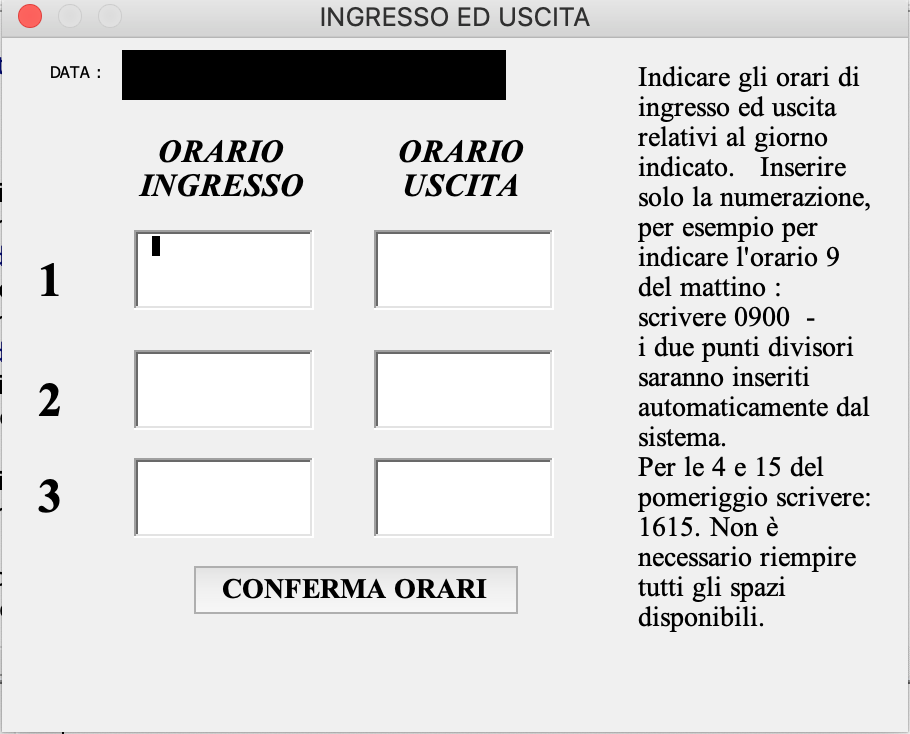
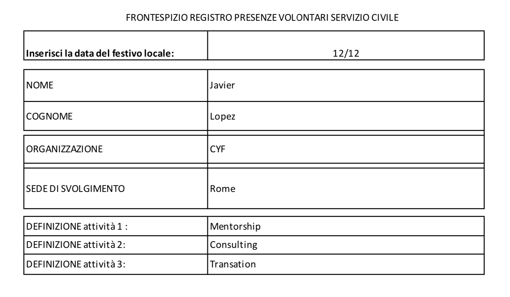

Visual Basic Files
___
|-- Microsoft Excel Objects  
   |-- Foglio1 (MODULO)  Registers the ingresso cells into a UserForm macro 
   (macro1 through macro7 to UserForm1 through UserForm 7)    
   |-- Foglio2 (Foglio2)  
   |-- Foglio3 (Foglio3)  Set up to automatically open and be selected
   |-- Foglio4 (RIEPILOGO)  
   |-- Foglio5 (REGISTRO)  
   |-- Questa_cartella_di_lavoro  
|-- Forms All forms look the same   
   |-- UserForm1 
   |-- UserForm2  
   |-- UserForm3  
   |-- UserForm4  
   |-- UserForm5  
   |-- UserForm6  
   |-- UserForm7  
|-- Modules  
   |-- Modulo1  Selects the MODULO sheet and selects B5    
   |-- Modulo2  Selects the MODULO sheet 
   |-- Modulo3  Opens the RIEPILOGO sheet and selects F1  
   |-- Modulo4  Empty  
   |-- Modulo5  Copies the data to the REGISTRO and remove contents from the MODULO sheet  
   |-- Modulo6  Save the current sheet into a PDF file  
   |-- Modulo7  Sends a copy of the REGISTRO sheet by email  
   |-- Modulo8  Copy the REGISTRO sheet  

Sample PDF file for the registration. 
